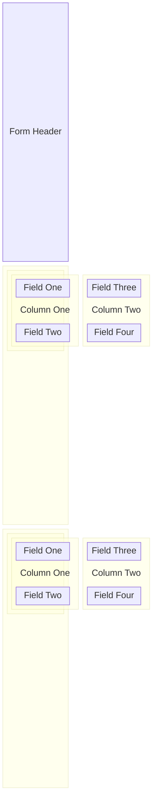

There are a couple of general terms that can be used to describe the domain of data capture and forms. Let's take a couple of liberties with the language to make it more natural, instead of purely technical.

First up, a form itself - we generally refer to all of the technical components as a **form**. People fill in **forms**, they don't complete form schemas. Administrators don't create form schemas to be completed, they create **forms**.

There is control over the way a form is **presented** to the person filling it out.




## Presentation

So, how is a form presented? Well, it's a hierarchical structure that uses sections, rows, columns and blocks.

A form can have several **sections** to break down long and complex forms into smaller, more manageable parts.

Each section can contain one or more **rows** that are used to break up the form section into vertical groups.

Each row can contain one or more **columns** that are used to break up the row into horizontal groups within a row.

Each column can contain one or more **blocks** that are used to break up the column into smaller, more manageable parts.

And each block can be used to **capture input** from the person filling out the form, or to **display some information** to them.

Here's how it might look, all laid out on one page:


---


Schemes are broken down into two areas: the `model` and the `view`. Let's take a look at an example schema and see how they fit together.

The following form schema has a single input field to capture someones full name:

```json expandable lines
{
  "id": "dfbe12c6-28b5-47bd-bb07-01b3b86d533f",
  "type": "form-schemas",
  "attributes": {
    "model": {
      "additionalProperties": false,
      "allOf": [],
      "properties": {
        "4d45fbad-bfb8-4fd9-bab7-694c7921f314": {
          "type": "string"
        }
      },
      "required": [
        "4d45fbad-bfb8-4fd9-bab7-694c7921f314"
      ],
      "type": "object"
    },
    "version": "1.0.0",
    "view": {
      "title": {
        "submit": [],
        "view": []
      },
      "description": {
        "submit": [],
        "view": []
      },
      "sections": [
        {
          "title": {
            "submit": [
              {
                "language": "en-GB",
                "value": "Occupant Details"
              }
            ],
            "view": [
              {
                "language": "en-GB",
                "value": "Occupant Details"
              }
            ]
          },
          "description": {
            "submit": [
              {
                "language": "en-GB",
                "value": "Let's collect some information about the occupant"
              }
            ],
            "view": [
              {
                "language": "en-GB",
                "value": "Occupant Details"
              }
            ]
          },
          "rows": [
            {
              "title": {
                "submit": [],
                "view": []
              },
              "description": {
                "submit": [],
                "view": []
              },
              "span": 12,
              "columns": [
                {
                  "title": {
                    "submit": [],
                    "view": []
                  },
                  "description": {
                    "submit": [],
                    "view": []
                  },
                  "span": 6,
                  "blocks": [
                    {
                      "title": {
                        "submit": [
                          {
                            "language": "en-GB",
                            "value": "Full Name"
                          }
                        ],
                        "view": [
                          {
                            "language": "en-GB",
                            "value": "Full Name"
                          }
                        ]
                      },
                      "description": {
                        "submit": [
                          {
                            "language": "en-GB",
                            "value": "What is their full name"
                          }
                        ],
                        "view": []
                      },
                      "placeholder": {
                        "submit": [
                          {
                            "language": "en-GB",
                            "value": "Enter name here..."
                          }
                        ],
                        "view": []
                      },
                      "id": "4d45fbad-bfb8-4fd9-bab7-694c7921f314",
                      "order": 0,
                      "options": {
                        "multiline": false
                      }
                    }
                  ],
                  "order": 0
                }
              ],
              "order": 0
            }
          ],
          "order": 0
        }
      ]
    }
  }
}
```

That's quite a lot of characters for a simple form, but there is a lot going on within it. Let's break it down:


## Model

The schema model is machine readable representation - we leverage [JSON Schema](https://json-schema.org) as the standard representation format, which is a widely adopted and well-documented specification. Whilst we accept any valid JSON schema, there are constraints around the support offered for advanced and complex schemas.

## View

The view represents the way a form should be shown to the user. It references the model fields and provides view focused configuration around them.

The view has a _title_ and _description_ which are shown to the person filling out the form.

### Sections

Forms can be split up into different sections. This is useful for larger forms, as it allows you to group related fields together and make the form more manageable for the person completing it.

Each section has its own _title_ and _description_ which are shown to the person filling out the form.

Each section can contain one or more rows.

### Rows

Rows are vertically arranged within a section.

Each row can have its own _title_ and _description_ which are shown to the person filling out the form.

A row can contain one or more columns.

### Columns

Columns are horizontally arranged within a row.

Each column can have its own _title_ and _description_ which are shown to the person filling out the form.

Each column can contain one or more blocks.

### Blocks

Blocks are the smallest unit of content within a column.

Blocks can have their own _title_ and _description_ which are shown to the person filling out the form.

They are used to capture data from the user or show information.
